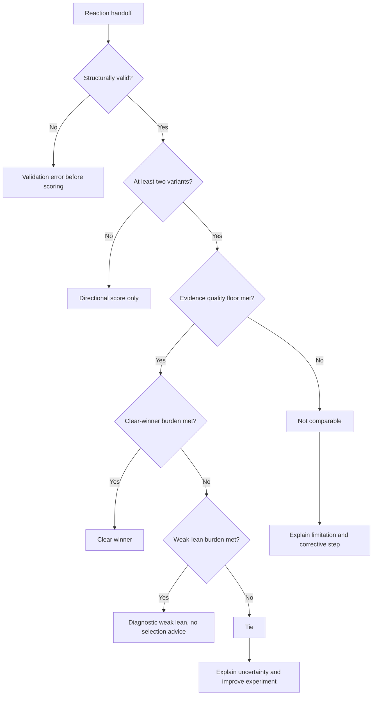

# Uncertainty-Aware Results - Plan

## Goal Capsule

- **Objective:** Make Synthetic Panel a stronger flagship open-source contribution by replacing forced rankings with conservative verdicts that distinguish supported winners from inconclusive comparisons.
- **Product authority:** The public `StartupBros-com/synthetic-panel` repository is the canonical product. House of Vibe is a teaching, feedback, and distribution channel rather than a separate product surface.
- **Open blockers:** None before implementation planning. The uncertainty method, decision thresholds, and result-contract details remain planning decisions constrained by this Product Contract.

---

## Product Contract

### Summary

Synthetic Panel will return a clear winner, a weak lean, or a tie based on the strength of the evidence in a comparison. A tie is a valid, actionable result that explains why the evidence is inconclusive and recommends the smallest useful improvement to the experiment.

### Problem Frame

Synthetic Panel v1 correctly positions its scores as directional and useful for relative ranking within one run. Its current behavior nevertheless sorts every variant by point score, assigns distinct ordinal ranks even to equal scores, and displays that ranking when a run is globally `not_comparable`.

This creates a mismatch between the project's honest positioning and its decision output. A small numerical difference can look like a supported winner even when the retained evidence does not distinguish the variants. For an open-source project promoted as a practical application of published research, avoiding false certainty is more important than always producing a satisfying answer.

The primary opportunity is open-source credibility, not proven recurring member demand. Discord provides one verified signal of member interest in the research-derived tool and its public release, but not evidence that House of Vibe needs a separate native application.

### Key Decisions

- **The verdict replaces forced ranking as the default guidance.** Raw scores remain inspectable, but they cannot make a tied or invalid comparison look like it has a meaningful first place.
- **The product is biased against false winners.** Marginal evidence should produce a tie rather than a recommendation, even when that misses a modest real difference.
- **A tie must help the user improve the experiment.** It should identify the limiting evidence and recommend the smallest change likely to make a new run more informative.
- **The release claim is behavioral, not predictive.** The project will prove that it handles clear, tied, collapsed, and undersampled cases as designed. It will not claim validated correlation with market outcomes without separate evidence.
- **The public repository remains canonical.** House of Vibe may teach and promote the improvement, but members-area integration is not part of this scope.

### Requirements

**Verdict behavior**

- R1. Each structurally valid scoring submission with at least two variants must produce one overall product verdict: clear winner, weak lean, tie, or not comparable.
- R2. A clear winner must identify the supported variant and communicate that the evidence separates it from the alternatives within the run.
- R3. A weak lean may identify the observed leader for diagnosis, but it must not recommend selecting that variant or present the ordering as dependable guidance.
- R4. A tie must withhold a winner and state that the observed differences are inconclusive.
- R5. A not-comparable result must withhold all winner and lean guidance when input quality or completeness makes the comparison untrustworthy.
- R6. A single-variant submission remains eligible for a directional score but cannot receive a winner, lean, or tie verdict.
- R7. Raw scores and distributions may remain available for diagnosis, but their presentation must remain subordinate to the verdict.
- R8. Equal or near-equal evidence must not receive distinct ordinal guidance solely because stable sorting produces an order.

**Evidence and trust**

- R9. The result must preserve enough evidence from the run to support and explain its verdict without relying only on averaged point scores.
- R10. Verdict confidence must account for both separation between variants and the quality and completeness of the underlying reactions.
- R11. A quality issue may be localized only by removing the same affected persona-and-sample coverage coordinates from every compared variant, after which every variant must retain equivalent clean coverage.
- R12. When matched exclusion does not leave equivalent clean coverage, the overall verdict must be not comparable.
- R13. The product must never display a directional ranking as actionable guidance when the governing verdict is weak lean, tie, or not comparable.
- R14. The language around uncertainty must remain directional and must not imply population-level accuracy, statistical significance, or market prediction that the benchmark does not establish.

**Submission integrity**

- R15. Malformed records, duplicate reaction keys, unknown variant or persona identifiers, and out-of-range sample identifiers must fail validation before scoring.
- R16. A structurally valid submission with missing expected reactions, empty required coverage, or reactions that trigger collapse checks must return not comparable rather than a hard input error.
- R17. Comparison verdicts require at least two separately supplied reactions per persona-and-variant cell. A stricter release minimum may be adopted only when documented calibration evidence shows that it is necessary to preserve the false-winner-first policy.

**Actionable inconclusive results**

- R18. Every tie or not-comparable result must explain the primary reason the evidence did not support guidance.
- R19. Every tie or not-comparable result must recommend the smallest useful next experiment, such as adding separately supplied reactions, improving weak persona evidence, or comparing more distinct variants.
- R20. The next-step guidance must not encourage repeated reruns of an unchanged weak setup as a way to manufacture a winner.

**Compatibility and public release proof**

- R21. Existing score details must remain available, while any field whose meaning changes must use a versioned result contract rather than silently changing v1 semantics.
- R22. The packaged skill and installation guidance must target the release that understands the uncertainty-aware result contract.
- R23. The improvement must include a public, reproducible benchmark with cases for an obvious winner, a weak lean, a near tie, collapsed reactions, and an undersampled comparison.
- R24. Each benchmark case must declare its expected verdict, pin the scoring configuration and fixture inputs, and show the evidence used to reach it.
- R25. The documented default local configuration must be release-gating; results from other supported embedding providers may be informational.
- R26. Verdict calibration must preserve an ordered burden of proof: clear winner requires stronger separation than weak lean, weak lean requires stronger directional evidence than tie, and any failed evidence-quality floor yields not comparable. Threshold changes must be justified against the pinned benchmark and approved as an explicit product-contract change.
- R27. The benchmark must document its limitations and distinguish behavioral correctness from validation against human preferences or real outcomes.
- R28. The README and packaged skill guidance must teach users to interpret ties and weak leans consistently with the product verdict.

### Decision Flow

### Key Flow

- F1. Evaluate a comparison
  - **Trigger:** A user submits a structurally valid reaction handoff for scoring.
  - **Steps:** The tool validates coverage, assesses observable evidence quality, evaluates separation between variants, selects one verdict, and prepares an explanation consistent with that verdict.
  - **Outcome:** The user receives decision guidance only when the evidence supports it, plus a useful corrective step when it does not.
  - **Covered by:** R1-R28

### Acceptance Examples

- AE1. **Clear winner. Covers R1-R2, R9-R10.** Given complete, separately supplied reactions with no detected quality issue whose evidence consistently separates one variant, when the comparison is scored, then the result names that variant as the clear winner and explains the supporting separation.
- AE2. **Near tie. Covers R1, R4, R8, R13, R18-R20.** Given two variants with inconclusive evidence, when one has a slightly higher point score, then the result returns a tie, withholds first-place guidance, and recommends the smallest useful experiment change.
- AE3. **Weak lean. Covers R1, R3, R7, R13-R14, R23-R26.** Given the pinned weak-lean fixture has consistent directional evidence that meets the weak-lean burden but not the clear-winner burden, when the comparison is scored under the release-gating configuration, then the result identifies the observed leader for diagnosis without recommending that the user select it.
- AE4. **Collapsed reactions. Covers R1, R5, R10, R13, R16, R18-R20.** Given reactions that trigger the defined collapse checks, when the comparison is scored, then the result is not comparable, no ranking is presented as guidance, and the corrective step requests better evidence.
- AE5. **Undersampled run. Covers R1, R5, R16-R20.** Given a structurally valid submission with missing expected reactions or fewer than the minimum reactions per cell, when the comparison is scored, then the result is not comparable and recommends collecting the missing separately supplied evidence.
- AE6. **Localized quality issue. Covers R10-R12.** Given a quality issue at one persona-and-sample coordinate, when that same coordinate is excluded from every compared variant and equivalent clean coverage remains, then the overall verdict may use the remaining evidence and must disclose the matched exclusion; otherwise the result is not comparable.
- AE7. **Malformed handoff. Covers R15.** Given a duplicate reaction key, unknown identifier, out-of-range sample identifier, or malformed record, when the handoff is submitted, then validation fails before scoring and no comparison verdict is produced.
- AE8. **Single variant. Covers R6-R7.** Given a valid submission containing one variant, when it is scored, then the result may show a directional score but does not produce a winner, lean, or tie.
- AE9. **Benchmark claim boundary. Covers R23-R28.** Given the pinned public benchmark passes all declared cases under the documented default local configuration, when the improvement is announced, then the project claims correct uncertainty behavior and does not claim proven prediction of human or market outcomes.

### Success Criteria

- The default result no longer turns every point-score ordering into winner guidance.
- All five benchmark classes produce their declared verdicts reproducibly.
- A user can understand why a run tied or failed and what to change next without reading the scoring implementation.
- Documentation, CLI output, and packaged skill guidance use the same verdict meanings.
- Public launch material accurately presents the feature as an honest uncertainty layer on a directional research instrument.

### Scope Boundaries

**Deferred for later**

- Validation against known human preferences or real A/B outcomes.
- Segment-disagreement views across personas.
- Persona evidence provenance and survey-grounded persona construction.
- Reaction-quality checks beyond those needed to protect the verdict.
- Copy attribution by ablation and stimulus-specific scoring anchors.
- Optional local generation and a one-command end-to-end run.

**Outside this product's identity**

- A separate native House of Vibe Synthetic Panel application.
- Absolute purchase-intent, population-representativeness, or market-outcome claims.
- A requirement to choose a winner for every valid run.

### Dependencies and Assumptions

- The shipped scoring pipeline can evolve its result contract while preserving v1's core emit, generate, and score workflow.
- Existing point scores remain useful diagnostic inputs but are not sufficient by themselves to support uncertainty verdicts.
- Sample-level evidence or an equivalent defensible evidence representation will need to survive long enough to support verdict selection and explanation.
- Existing model-dependent seam tests exercise a clear ordering, collapsed reactions, and a missing sample. None currently constitutes the required public benchmark, and a near-tie case is net new.

### Outstanding Questions

**Deferred to planning**

- Which uncertainty method best fits the small-sample, directional nature of the instrument?
- Which uncertainty method and conservative numeric thresholds best implement the ordered verdict burdens while keeping every pinned benchmark case stable?
- Does calibration evidence justify a clean-coverage minimum stricter than the two-reaction floor before a localized quality issue can still yield an overall verdict?
- What versioned result shape best preserves existing score details while preventing legacy ranking consumers from mistaking tied results for guidance?
- Which benchmark fixtures provide deterministic coverage without overstating external validity?

### Sources and Research

- `README.md:6-10`, `README.md:27-45`, and `README.md:59-65` establish relative-ranking positioning and the directional-score limitation.
- `synthetic_panel/scoring.py:146-158` defines the weighted point score derived from a Likert distribution.
- `synthetic_panel/testing.py:295-391` averages point scores and sorts every variant into an ordinal ranking.
- `synthetic_panel/testing.py:272-285` and `synthetic_panel/testing.py:303-375` show which distributions and point-score summaries survive in the current result.
- `synthetic_panel/testing.py:226-270`, `synthetic_panel/testing.py:322-335`, and `synthetic_panel/testing.py:393-414` define global comparability and its current relationship to ranking output.
- `synthetic_panel/cli.py:169-183` displays a directional ranking even when the comparison is not comparable.
- `tests/test_seam.py:103-176` covers a clear ordering, collapsed reactions, and missing samples. It does not cover near ties.
- Discord thread in `#ic-lounge`, March 17 through July 3, 2026: Ben asked about the research-derived tool, followed up on its release, and received the public repository link. This supports open-source and educational interest, not recurring native-app demand.
- Semantic Similarity Rating paper: arXiv:2510.08338.
